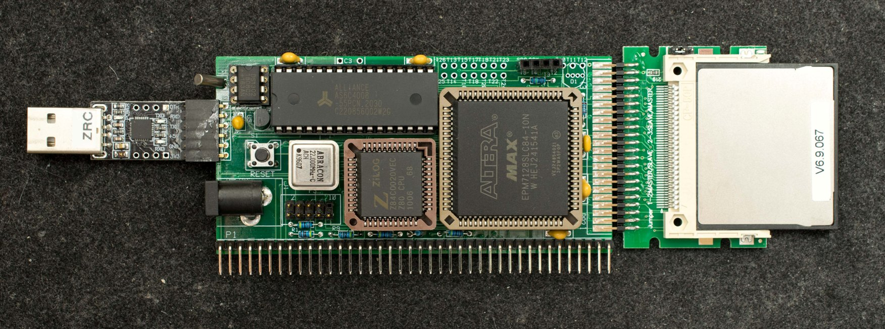
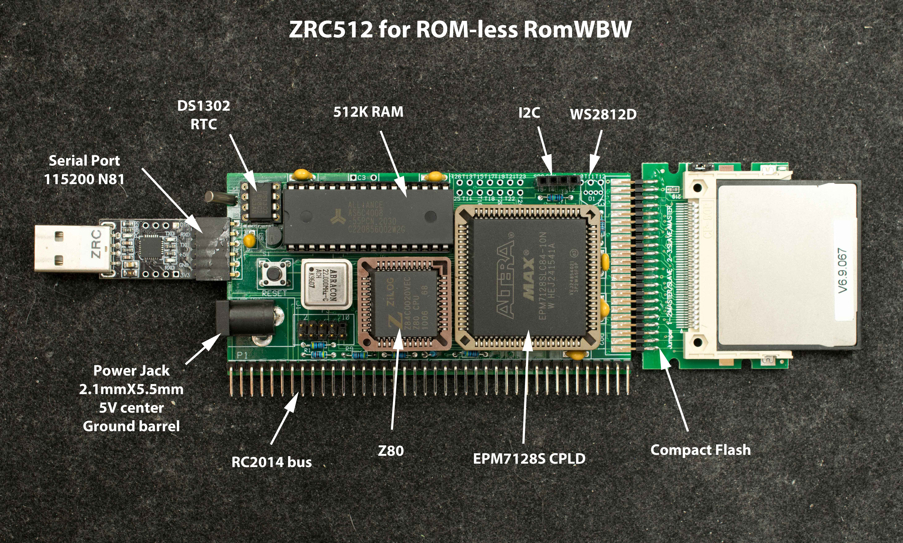

# ZRC512, A Hobbyist-friendly Z80 SBC for ROM-less RomWBW
### Introduction
ZRC512 is a faster and hobbyist-friendly variant of ZRC. It is designed specifically for ROM-less RomWBW. It has few components all in easy-to-build through-hole technology.
Description of ZRC512 online here.

### Features
- Z80 at 22MHz
- 512K RAM in 16 banks of 32K
- Compact flash interface
- Altera EPM7128S CPLD
  - 64-byte bootstrap ROM
  - Serial port
  - Decode for RAM, CF, and peripherals
  - I2C interface
  - DS1302 RTC interface
  - WS2812B interface
- RC2014 bus interface
- 5V at 250mA, typical
- 2“x4” 4-layer pc board

### Theory of Operation
Place holder

### Design Information
- [Schematic](zrc512_rev0_scm.pdf)
- [Gerber photoplots](zrc512_rev0_gerber.zip)
- [Bill of Materials](zrc512_rev0_bom.pdf)
-[CPLD design files](zrc512_rev0_pcb_cpld_released.zip)
  - ROMCPLD, 64-byte [bootstrap ROM](Software/rev1_1pcb_cpldcf.zip) resides in CPLD
### Software
- [ZRC512 Monitor](Software/zrc512mon_rev0_3.zip), rev0.3
- ROM-less RomWBW for ZRC512
- [CF disk image](Software/zrc512_romwbw_hd1k_zrc512_combo.zip) of ZRC512 monitor and RomWBW. Unzip this file and use Win32DiskImagers to copy the image to 64meg or larger CF disk
- [ZRC512 addition to RomWBW source](Software/zrc512_addition_to_romwbw_source.zip). Future update of RomWBW should include these files. This zip file includes a command file “BuildZRC512.cmd” and a directory “ZRC512” that go into RomWBW\Source directory.
- [Driving WS2812 NeoPixel](Software/Driving_WS2812B_neopixel.md) LED. The linked page describe the operation for bit-bang WS2812 LED. A demo program included.
- Disk image of [ZRC512 + VGARC](Software/cf_image_romwbw_zrc512_working_vgarc.zip) to support standalone computer with monochrome text VGA display and PS2 keyboard.

### Manuals
### Online discussions
Discussion about ZRC512 on [Google forum](https://groups.google.com/g/retro-comp/c/bILDMVI97vo). There were informative discussions about different flavors of WS2812D starting from Dec 19 2023.

